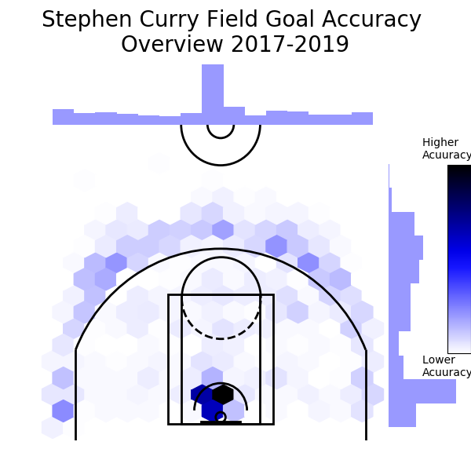
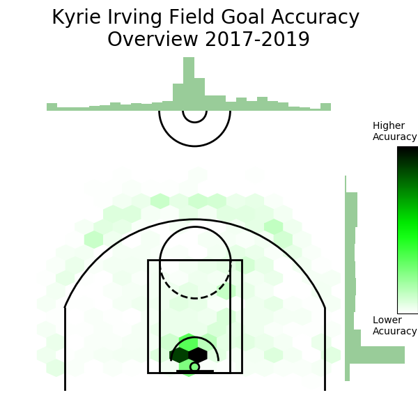
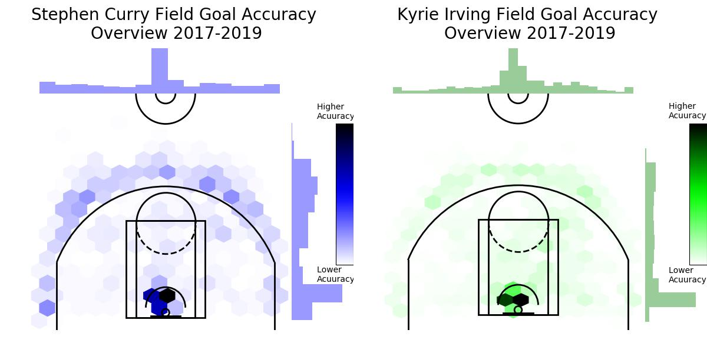

# FieldGoalAccuracy30vs11
A shot chart comparison demonstrating the difference between Curry's and Kyrie's shooting positions on the court and their accuracy with respect to these positions.

# Research Question
How does Stephen Curry's Shooting Range and Accuracy differ from that of Kyrie Irving's?

Region: The United States of America (NBA)
Domain: Sports

# Datasets
I made my own datasets with information from the following because the stats.nba.com stopped sharing their shot chart information through their private API's:
Steph's Basketball Reference Shooting page: https://www.basketball-reference.com/players/c/curryst01/shooting/2019
Kyrie's Basketball Reference Shooting page: https://www.basketball-reference.com/players/i/irvinky01/shooting/2019

Find the datasets in the form of .txt files below:

StephShots.txt: https://drive.google.com/file/d/1CyknVZ5YnnmtzOPm6HGLyDzNKBp_-PMk/view?usp=sharing
KyrieShots.txt: https://drive.google.com/file/d/1d0P2AenforBsU6HtBeqV3lzlK_ULBY5J/view?usp=sharing

# Individual plots
Stephen Curry Shot Chart:

Kyrie Irving Shot Chart:

# Comparison Chart

# Visual Justification
NBA is a men's professional basketball league in North America and has been the most popular basketball league for ages. The strengths and weaknesses of the players of the NBA might be known on the surface level to the average fan. For example, Steph Curry is known for his three-pointers, and Kyrie is better known for his layups. However, the exact positions that are favored by them may not be known. Their preferences based on their shots, their positions, their ranges are all mostly unknown to us.
My research and visual, inspired by Kirk Goldsberry delves deeper into the specifics of these attributes, which I believe will give better insights to coaches and team members to develop stronger gameplay strategies. The visual portrays the accuracy of the shots taken by the two players with the help of hex bins. The locations on the court where they have made more shots have a deeper color and the locations where they have made lesser shots have a lighter color. The missed attempts have not been taken into consideration for this visualization. Analyzing this plot can give insights about a player’s game just at a glance. Through this plot, the question ‘How does Stephen Curry's Shooting Range and Accuracy differ from that of Kyrie Irving's?’ is answered.

# Applied Cairo's principles
Truthfulness: My visual is true to my knowledge as I have taken all the relevant information from the source and have not hidden any data to suit my own interest. I have not shown any bias towards either of the players and plotted the entire dataset available to me.

Beaty: I have removed every irrelevant aspect of the plot, i.e I have dejunkified it by removing ticks and used pleasant colours to demonstrate the information in the most aesthetic manner possible.

Functionality: The plot clearly serves its purpose since it portrays the information with the utmost clarity. I have also provided a colour bar and title to make the plot more readable.

Insightfulness: I believe even an average person can figure out both player's preferred positions to take shots because of the hex bins. This gives us, as well as basketball coaches a good insight into a player's strong and weak points. The histograms on the top and right gives added insight into their preferred positions.

# References

Applied Data Science with Python Specialization(Coursera)
https://stackoverflow.com/
http://savvastjortjoglou.com/nba-shot-sharts.html
https://www.codespeedy.com/merge-two-images-in-python/
https://www.basketball-reference.com/players/i/irvinky01/shooting/2019
https://www.basketball-reference.com/players/c/curryst01/shooting/2019
https://seaborn.pydata.org/
https://matplotlib.org/

